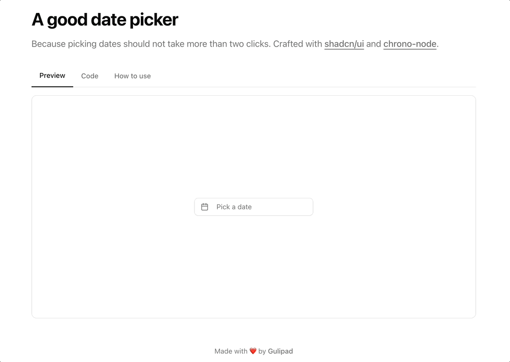

# Natural‑Language Date Picker 🤖📅

> **Stop double‑clicking your way to 2042.**
>
> Type _"next Friday"_, press ↵, go live your life.

The humble date‑picker hasn't evolved much since jQuery UI. We still poke at tiny arrows to escape the current month like frantic Minesweeper players. This natural language date picker fixes that: it lets your users speak calendar‑ese in plain English, while still giving them a pretty calendar to fall back on.

_(It's basically the child of **shadcn/ui** components and **chrono‑node**'s time‑travel super‑powers.)_

---

## Demo



---

## Quick Start

```bash
# 1. Install dependencies
npm i chrono-node date-fns lucide-react react-day-picker

# 2. Make sure you have shadcn/ui set up (see Prerequisites below 👇)

# 3. Copy the component
cp path/to/nl-date-picker.tsx your‑project/components/ui/
```

That's it. Import the component and enjoy:

```tsx
import { NaturalLanguageDatePicker } from "@/components/ui/nl-date-picker";

export default function Example() {
  const [date, setDate] = React.useState<Date>();
  return <NaturalLanguageDatePicker value={date} onChange={setDate} />;
}
```

_(The component is self‑contained; `value`/`onChange` are optional if you're cool with internal state.)_

---

## Why Should I Care?

| 🎯 Traditional pickers                             | 🚀 **Natural Language Picker**  |
| -------------------------------------------------- | ------------------------------- |
| Endless clicks to reach 18 months away             | One ⌨️ stroke: `"+18 months"`   |
| Hard to type on mobile, even harder to tab through | Accessible input _and_ calendar |
| Users must think like a computer                   | Lets people speak like people   |

---

## The Recipe 🍳

### 1. Prerequisites

- **React 18** (Next.js ≥ 13 works great)
- **Tailwind CSS 3** configured
- **shadcn/ui** set up (`npx shadcn-ui@latest init`)
  - Required components:
    - `npx shadcn-ui@latest add button`
    - `npx shadcn-ui@latest add input`
    - `npx shadcn-ui@latest add popover`
    - `npx shadcn-ui@latest add calendar`

### 2. Dependencies

```bash
npm i chrono-node date-fns lucide-react react-day-picker
```

> **Heads‑up**: the component imports `cn` from `@/lib/utils` (a shadcn/ui utility).
> This should be set up during shadcn/ui initialization, but if you need it:

```ts
// lib/utils.ts
import { clsx, type ClassValue } from "clsx";
import { twMerge } from "tailwind-merge";

export function cn(...inputs: ClassValue[]) {
  return twMerge(clsx(inputs));
}
```

### 3. Drop the Component In

Place **`nl-date-picker.tsx`** in your components directory (we use `components/ui`). Make sure path aliases match your setup. The component is named `NaturalLanguageDatePicker` - you can rename it during import if you prefer something shorter.

---

## Props

| Prop                                                       | Type                    | Default | Description                 |
| ---------------------------------------------------------- | ----------------------- | ------- | --------------------------- |
| `value`                                                    | `Date \| undefined`     | —       | Controlled value            |
| `onChange`                                                 | `(date?: Date) => void` | —       | Callback fired on selection |
| \*…plus any props from the underlying shadcn **Popover\*** | —                       | —       | Pass‑through props          |

_(Need something else? PRs welcome – or just fork and hack away.)_

---

## Customising ✨

- **Styling** – It's Tailwind all the way down. Tweak classes right in the file or wrap the component.
- **Locales** – Swap `date-fns/format` for `formatInTimeZone` or your i18n flavour.
- **Parsing** – `chrono-node` already understands _"next Thursday at 6 pm CET"_. Extend its grammar if your users speak in riddles.
- **Natural Language** - Some examples that work out of the box:
  - "next Friday"
  - "in 2 weeks"
  - "tomorrow at 3pm"
  - "next month"
  - "+3 months"
  - "2024-03-15"

---

## Contributing

1. `git clone` this repo
2. `npm i && npm run dev` – open <http://localhost:3000>
3. Make magic ➡️ `git commit -m "feat: dragons can pick dates too"`

---

## License

MIT – because date picking should be free (and painless).
